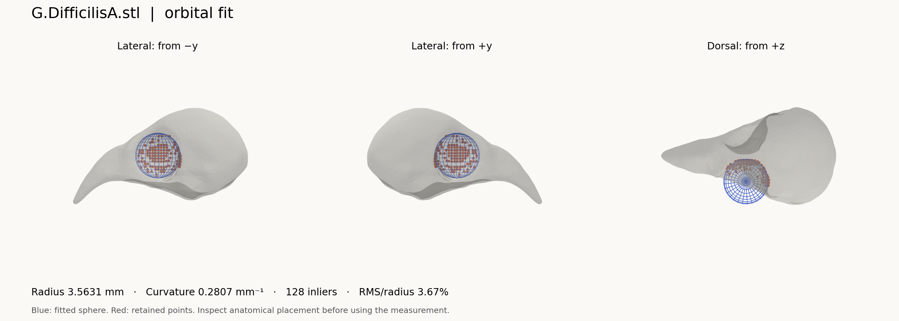

# Getting started

This guide covers installing the code, fitting an example skull and analysing your own prepared STL meshes.

[Project overview](../README.md) · [Visual guide](index.html) · [Video tutorial, 7:09](assets/tutorial.mp4) · [Reproduction guide](REPRODUCE.md)

## 1. Download and install

On the repository page, choose **Code → Download ZIP** and extract it. Keep the folders together. Install **Python 3.12** if you do not already have it. PyCharm or VS Code is optional.

Open a terminal in the extracted project folder, where `quickstart.py` and `requirements.txt` are located.

**macOS / Linux**

```bash
python3 -m venv .venv
source .venv/bin/activate
python -m pip install -r requirements-quickstart.txt
python quickstart.py
```

**Windows Command Prompt**

```bat
py -3.12 -m venv .venv
.venv\Scripts\activate.bat
python -m pip install -r requirements-quickstart.txt
python quickstart.py
```

If using an editor, select this `.venv` as the project interpreter. Packages installed in a different Python environment will not be visible to it.

The first example uses the supplied, prepared `G.DifficilisA.stl` skull. It fits one orbit with the existing `4_two_orbits/verify_fit.py` implementation. It does not require MATLAB, a display server or the interactive PyVista viewer.

## 2. Open the results

The terminal prints the output folder. Open these files in `output/quickstart/`:

| File | What to do with it |
| :--- | :--- |
| `inspection.png` | Inspect both lateral views and the dorsal view. Confirm that the blue sphere and red inliers lie in the orbit. |
| `measurements.csv` | Open in Excel or your analysis software. One row contains dimensions, radius, curvature and fit diagnostics. |
| `run.json` | Keep with the results. It records the mesh checksum, settings, Python version and package versions. |

For a successful numerical fit, `status` is `ok`. This describes the numerical routine, not a biological decision. `s4_screen_pass` reports whether the fit meets the SI Section S4 count/error screen; inspect the anatomy even when it is `True`.



[Example CSV](assets/example-measurements.csv) · [Example run record](assets/example-run.json)

The supplied example should give an orbit radius of about **3.56 mm**. Small numerical differences can depend on the software environment. If the result is substantially different, compare your settings and versions before applying the workflow to other skulls.

Running the example again replaces the files in its output folder. Use a new `--output` directory to retain an earlier run.

## Use your own skulls

### 3. Prepare the inputs

For the bird fitting scripts, use:

- **One skull per triangular STL file**, with coordinates in **millimetres**. STL does not record a unit label; confirm the scale in your source software.
- **The intended anatomical orientation:** x along the skull, beak at −x, posterior at +x, z dorsal. Compare with a supplied mesh. The fitters do not orient an arbitrary raw scan for you.
- **Prepared mesh resolution comparable to the supplied specimens.** The bird meshes were remeshed; the paper describes an average vertex spacing of about 0.8 mm. This is a study characteristic, not a universal prescription for every taxon or scale.

Do not rescale each skull to unit size: the radius bounds and curvature-neighbourhood radius use physical units. The numerical routines retain the largest connected component; inspect fragmented inputs so that the retained component is the intended skull.

Raw scans need preparation first. The wrappers in `1_remeshing/` require **MATLAB and external remeshing code**, which is not bundled. See [remeshing setup](../1_remeshing/Remeshing/README.md). The already prepared example data let you start without this step.

### 4. Try one of your prepared bird skulls

From the project folder:

```bash
python quickstart.py --mesh "data/My_skulls/specimen.stl" --output "output/specimen-check"
```

Replace the quoted path with your file. This still uses the finch settings. If you need other settings or a full folder of skulls, use the batch script below.

### 5. Measure a folder of skulls

Install the full dependencies in the same environment:

```bash
python -m pip install -r requirements.txt
```

Create `data/My_skulls/` and place your prepared STL files there. Open `2_fitting/fit_sphere_batch.py`. Replace its existing `DIRECTORY_PATHS` list with:

```python
DIRECTORY_PATHS = [paths.DATA / "My_skulls"]
```

The default list processes the honeycreepers, their cardueline relatives and the rodents. Replace the whole list to run only your own specimens. Keep filenames unique across input folders because image filenames use each specimen’s stem.

Then run the script from the project folder:

```bash
python 2_fitting/fit_sphere_batch.py
```

Or select that file in PyCharm and press **Run**. By default it saves images without opening one window per skull. The outputs are:

| Output in `2_fitting/output/fit_sphere_batch/` | Contents |
| :--- | :--- |
| `measurement_sphere_fitting_ALL.xlsx` | Successful numerical fits, measurements and diagnostics |
| `images/` | Three-view inspection image for each successful fit |
| `failed_files.txt` | Files with no numerical fit and rejected seed attempts |

Check the console and failed-file log as well as the workbook. An absent specimen is not a zero measurement. Keep runs in separate copies or move the generated output folder before rerunning if you want to preserve prior results.

### 6. Read the measurement columns

| Column in the batch workbook | Meaning | Units |
| :--- | :--- | :--- |
| `length_x`, `width_y`, `height_z` | Extents of the axis-aligned bounding box | mm |
| `sphere_radius` | Radius of the sphere fitted to the selected orbit surface | mm |
| `curvature` | Reciprocal of that radius, `1/r` | mm⁻¹ |
| `n_candidates` | Selected connected points before robust refinement | Count |
| `n_inliers` | Points retained after refinement | Count |
| `rms_residual_mm` | RMS radial distance of retained points from the fitted sphere | mm |
| `rms_over_radius` | RMS divided by fitted radius; `0.10` means 10% | Dimensionless |
| `fit_side` | Sign of the fitted centre’s y coordinate; inspect before assigning anatomical left/right | Sign |

The quickstart CSV uses the original headless fitter’s names: `rms_mm` and `fit_err_pct`. **`fit_err_pct = 10` means 10%; `rms_over_radius = 0.10` means the same thing.**

### 7. Inspect and screen every fit

Open the images. Check that the selected patch belongs to the orbital socket, that the sphere is not fitted to a damaged edge or another cavity, and that enough of the orbit lies inside the search band.

The SI Section S4 generalization analysis uses **at least 40 inliers and RMS/radius ≤ 0.10** as a diagnostic screen. These criteria are necessary rather than sufficient for that analysis; they also flag some fits in the original finch sample. They are **not automatically applied to exclude rows** by `fit_sphere_batch.py`.

**Video clarification, around 4:20:** the supplied tutorial calls this “a fit is accepted when…”. Read that as the S4 diagnostic screen, followed by visual inspection. It is not a universal acceptance rule or the script’s internal candidate threshold. The internal `MIN_CONNECTED_POINTS = 20` checks the candidate patch before refinement, which is a different quantity.

### 8. Adapt settings for a different taxon

| Setting | Supplied finch default | What it controls |
| :--- | :--- | :--- |
| `ROI_START_PERCENT`, `ROI_END_PERCENT` | `0.30`, `0.70` | Search band as a fraction of the skull’s x extent, starting at minimum x |
| `MIN_ORBIT_RADIUS`, `MAX_ORBIT_RADIUS` | `2.0`, `6.0` | Strict radius bounds, in mm |
| `CURVATURE_RADIUS` | `2.0` | Neighbourhood radius for curvature, in mm |
| `TARGET_POINT_COUNT` | `400` | Candidate vertices ranked by concavity |
| `MIN_CONNECTED_POINTS` | `20` | Minimum connected candidate patch size |

Choose settings for the anatomical scale and mesh preparation, document them, and inspect outcomes. Do not widen thresholds merely to force numerical success. Long bills can shift the orbit relative to the fixed length-based band.

The batch script supports `FOLDER_OVERRIDES` keyed by folder name. It already has a `Peromyscus` override, so a folder’s name can change the settings it receives. The human example script uses a **10–50% search band and a 2–60 mm radius window**. See [data sources and scope](../data/README.md) for the results and limitations of the mammalian examples.

### 9. Fit the neurocranium

In `2_fitting/fit_ellipsoid.py`, set:

```python
DIRECTORY_PATH = str(paths.DATA / "My_skulls")
ENABLE_VISUALIZATION = True
```

Run:

```bash
python 2_fitting/fit_ellipsoid.py
```

Close each 3D window to continue to the next specimen. The batch workbook is written at the end to `2_fitting/output/fit_ellipsoid/measurement_ellipsoid_fitting_ALL.xlsx`. The default ROI is the posterior 40% of the x extent.

`ellipsoid_axis_a`, `ellipsoid_axis_b` and `ellipsoid_axis_c` are **semi-axis lengths** along the coordinate axes. They are not full diameters or direct brain volumes. This axis-aligned fit depends on the chosen orientation.

## If something goes wrong

| Symptom | Next check |
| :--- | :--- |
| `ModuleNotFoundError` | Activate `.venv`; install the requirements using that interpreter’s `python -m pip`. |
| No STL files found | Check the folder path and that the ZIP was extracted. Use lowercase `.stl` for all original scripts; the batch script also accepts `.STL`. |
| 3D window seems to pause processing | Close it to continue; this is expected for the interactive scripts. |
| PyVista/OpenGL rendering fails | Run `quickstart.py` for a static image, or set `ENABLE_VISUALIZATION = False` in the batch script to export measurements and use a working viewer separately. |
| No fit, too few inliers, implausible sphere | Check units, orientation, fragmentation, resolution and ROI placement before adjusting settings. |
| MATLAB remeshing code not found | The remeshing dependency is external. Use supplied prepared meshes first, then configure the remeshing folder. |
| Results differ from the paper | Record versions and settings, check which workbook was used, and follow the reproduction guide. |

[Next: reproduce the paper](REPRODUCE.md) · [All scripts](REFERENCE.md)
